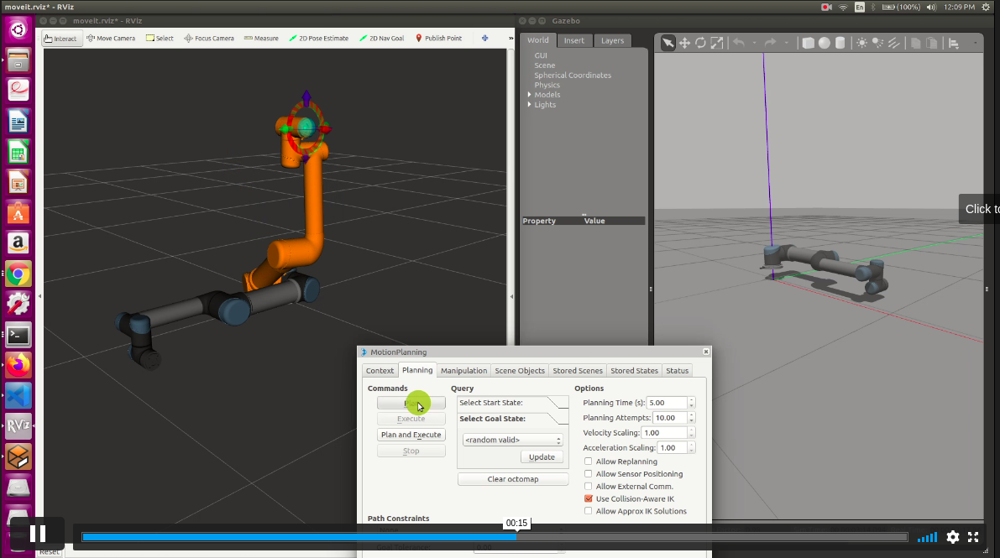
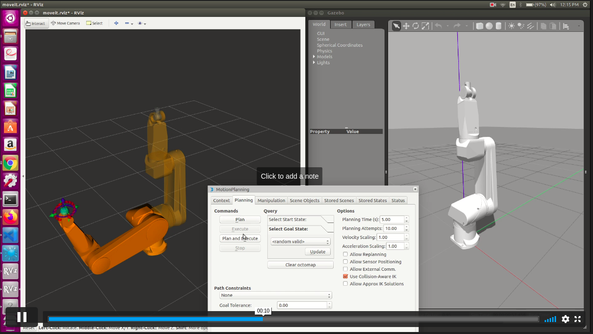
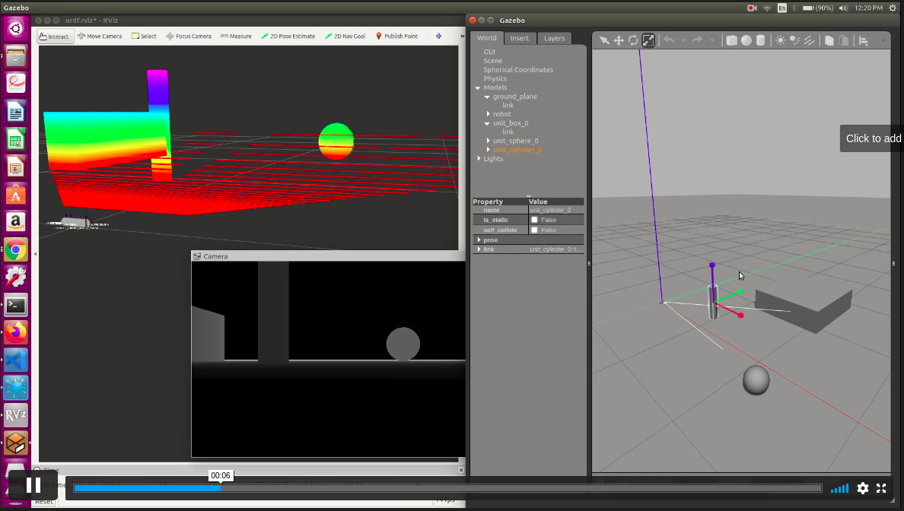
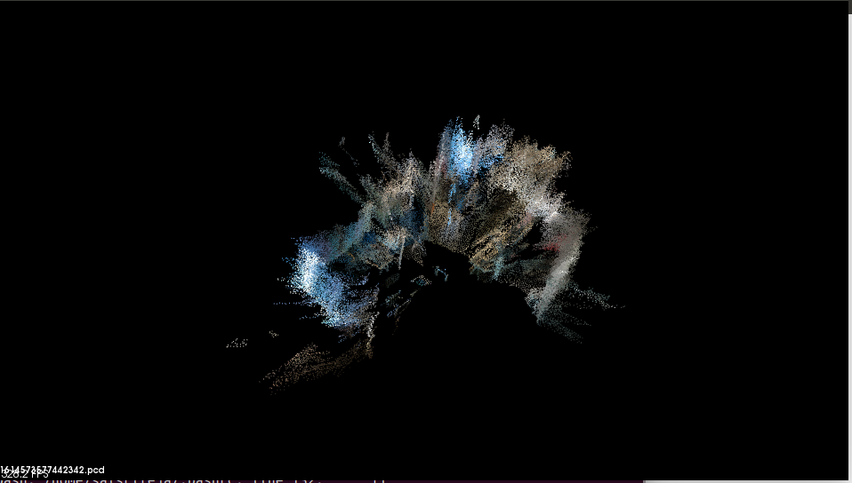

# HTIC Spine Robotics Surgery

This repository consists of works regarding serial robotics which includes ROS Simulations and sensors integration.

# OneNote Links for my Personal Documentation
* [Fundementals of ros](https://1drv.ms/u/s!AsUceu602PstgjxjVIJSvhT7ExGn?wd=target%28complete%20work.one%7C59597DC3-98B0-4407-BB7D-2B3E11A300DE%2FFundementals%20of%20ROS%7CAFF9DDEA-4606-44F8-A711-B633C9F60F8E%2F%29onenote:https://d.docs.live.net/2dfbd8b4ee7a1cc5/Documents/Robotics/ros/complete%20work.one#Fundementals%20of%20ROS&section-id={59597DC3-98B0-4407-BB7D-2B3E11A300DE}&page-id={AFF9DDEA-4606-44F8-A711-B633C9F60F8E}&end)

* [ROS and Gazebo](https://1drv.ms/u/s!AsUceu602PstgjxjVIJSvhT7ExGn?wd=target%28complete%20work.one%7C59597DC3-98B0-4407-BB7D-2B3E11A300DE%2FROS%20and%20Gazebo%7C62D8A1B6-A633-4B13-82A4-4C1D5DD598F6%2F%29onenote:https://d.docs.live.net/2dfbd8b4ee7a1cc5/Documents/Robotics/ros/complete%20work.one#ROS%20and%20Gazebo&section-id={59597DC3-98B0-4407-BB7D-2B3E11A300DE}&page-id={62D8A1B6-A633-4B13-82A4-4C1D5DD598F6}&end)

* [ROS and Moveit](https://1drv.ms/u/s!AsUceu602PstgjxjVIJSvhT7ExGn?wd=target%28complete%20work.one%7C59597DC3-98B0-4407-BB7D-2B3E11A300DE%2FROS%20and%20MoveIT%7C8DC7C664-3A28-4F9D-90F8-C8FECBF05927%2F%29onenote:https://d.docs.live.net/2dfbd8b4ee7a1cc5/Documents/Robotics/ros/complete%20work.one#ROS%20and%20MoveIT&section-id={59597DC3-98B0-4407-BB7D-2B3E11A300DE}&page-id={8DC7C664-3A28-4F9D-90F8-C8FECBF05927}&end)

* [MoveIT and Realtime hardware](https://1drv.ms/u/s!AsUceu602PstgjxjVIJSvhT7ExGn?wd=target%28complete%20work.one%7C59597DC3-98B0-4407-BB7D-2B3E11A300DE%2FMove-IT%20and%20real%20time%20hardware%7CA49547BE-EA92-47E5-9119-CBB48C590C89%2F%29onenote:https://d.docs.live.net/2dfbd8b4ee7a1cc5/Documents/Robotics/ros/complete%20work.one#Move-IT%20and%20real%20time%20hardware&section-id={59597DC3-98B0-4407-BB7D-2B3E11A300DE}&page-id={A49547BE-EA92-47E5-9119-CBB48C590C89}&end)

* [Making a custom 3d robot](https://1drv.ms/u/s!AsUceu602PstgjxjVIJSvhT7ExGn?wd=target%28complete%20work.one%7C59597DC3-98B0-4407-BB7D-2B3E11A300DE%2FMaking%20a%203d%20robot%7CB55E3C99-EC55-49D4-BE90-78C6E75D7BBB%2F%29onenote:https://d.docs.live.net/2dfbd8b4ee7a1cc5/Documents/Robotics/ros/complete%20work.one#Making%20a%203d%20robot&section-id={59597DC3-98B0-4407-BB7D-2B3E11A300DE}&page-id={B55E3C99-EC55-49D4-BE90-78C6E75D7BBB}&end)

* [Industrial Robotics](https://1drv.ms/u/s!AsUceu602PstgjxjVIJSvhT7ExGn?wd=target%28complete%20work.one%7C59597DC3-98B0-4407-BB7D-2B3E11A300DE%2FIndustrial%20Robotics%7C6DB47C2A-7C9A-4C2D-A889-D6B6A2C50982%2F%29onenote:https://d.docs.live.net/2dfbd8b4ee7a1cc5/Documents/Robotics/ros/complete%20work.one#Industrial%20Robotics&section-id={59597DC3-98B0-4407-BB7D-2B3E11A300DE}&page-id={6DB47C2A-7C9A-4C2D-A889-D6B6A2C50982}&end)

* [Integration of 3D sensors](https://1drv.ms/u/s!AsUceu602PstgjxjVIJSvhT7ExGn?wd=target%28complete%20work.one%7C59597DC3-98B0-4407-BB7D-2B3E11A300DE%2F3D%20sensors%7C067EBAEF-0471-42F4-B655-009E2941512E%2F%29onenote:https://d.docs.live.net/2dfbd8b4ee7a1cc5/Documents/Robotics/ros/complete%20work.one#3D%20sensors&section-id={59597DC3-98B0-4407-BB7D-2B3E11A300DE}&page-id={067EBAEF-0471-42F4-B655-009E2941512E}&end)

* [3D sensors](https://onedrive.live.com/redir?resid=2DFBD8B4EE7A1CC5%21316&page=Edit&wd=target%283D%20Sensors.one%7Ce1dc770d-6764-41ae-8fa2-aa2cdf3acf17%2F%29&wdorigin=717) 


you can find the complete notes [here](https://1drv.ms/u/s!AsUceu602PstgjxjVIJSvhT7ExGn).

# Simulation of UR5

## Using GUI 
The following lines of code can bring up the Gazebo, Rviz with ur5 bot in it.

```
roslaunch ur_gazebo ur5.launch limited:=true
roslaunch ur5_moveit_config ur5_moveit_planning_execution.launch sim:=true limited:=true
roslaunch ur5_moveit_config moveit_rviz.launch config:=true
```
```
roslaunch ur_robot_driver ur5_bringup.launch robot_ip:=127.0.0.1
```
for more information regarding the UR5 and simualtions go to [UR_ROS_tutorial](http://wiki.ros.org/universal_robot/Tutorials/Getting%20Started%20with%20a%20Universal%20Robot%20and%20ROS-Industrial), [Universal_robot_github](https://github.com/ros-industrial/universal_robot) 


#### demo

[](https://vimeo.com/512432352 "UR5 using GUI - Click to Watch!")


# Simulation of Staubli RX160
The following lines of code can bring up the Gazebo, Rviz with ur5 bot in it.

```
roslaunch stuabli_rx160_moveit_config demo_gazebo.launch
```

I had made changes for the moveit_config file, since there is no gazebo launch files prewittern in the original staubli repository.

Note1: If you want to make you own changes for the moveit_config file from strach then follow this [tutorial](https://www.youtube.com/watch?v=O7nBa7mnfW4), [github](https://github.com/lFatality/ros_moveit_gazebo_ws) (even the video is in Malayalam you can understand the sequence of step in a perfect way).


#### demo

[](https://vimeo.com/512432400 "staubli using GUI - Click to Watch!")


# Simulation of Intel RealSense depth camera D435
The following lines of code can bring up the Gazebo, Rviz with realsense camera in it. 

```
roslaunch realsense2_description view_d435_model_rviz_gazebo.launch
```


Note1: you need to add the 3d objects in the gazebo which are available on top of the menu bar. In rviz you can see the depth and the camera perception.

Note2:  The gazebo plugin is readily available with the [IntelRealSense](https://github.com/IntelRealSense/realsense-ros) repo. So this took to me another [repo](https://github.com/pal-robotics/realsense_gazebo_plugin) by pal robotics. However for the complete setup I have been following the this [tutorial](https://www.youtube.com/watch?v=hpUCG6K5muI), [modified_realsense_description2](https://github.com/issaiass/realsense2_description), [gazebo_plugin](https://github.com/issaiass/realsense_gazebo_plugin). I could tell that the last 2 repositories would be enough to simulate the necessary stuff.


#### demo

[](https://vimeo.com/512432308 "Intel RealSense D435 - Click to Watch!")

when a real sense hardware is available:

```
roslaunch realsense2_camera rs_rgbd.launch
rviz
```

```
roslaunch realsense2_camera opensource_tracking.launch
rviz
```

RealSense [SLAM](http://robotsforroboticists.com/wordpress/wp-content/uploads/2019/09/realsense-sep-2019.pdf) tutorial

SLAM complete setup and working process go to [github](https://github.com/IntelRealSense/realsense-ros/wiki/SLAM-with-D435i).

Things to remember while doing slam:
* don't forget to turn on mapgraph, else you will be seeing the current mesh cloud rather than a complete picture of the room.
* do check the quality of in the terminal, if it goes to zero better go in slow velocity, if still no use, better restart.
* use the pcl_veiwer command to check the entire slam output in the end.
* the rosbag file stores data in GB, delete this file in the end if your work is done.


Getting a 3D mesh out of cloud points: [colab](https://colab.research.google.com/drive/1fqXiP8KITOCTaoIi8V6HIQ6b13J95pfA?usp=sharing)
Inside the collab file you have both the code for the python to capture data and store in .npy format and then you have basic visual to make a 3d mesh out of the cloud data you have.

[]


# Useful Info

## Working together with Anaconda and ROS. 
when anaconda is installed along with ros, always give the path explicitly, since we need ros primarly than conda.
1.open a terminal

Type: 
```
export PATH="/home/saisriteja/anaconda3/bin:$PATH"
```

and then activate anaconda navigator by typing:
``` 
anaconda-navigator
```


## Set Bot in Free Drive To get Data

You can connect urx and ur-rtde at the same time, to collect data from the robot I have used ur-rtde and I have used IPython to set the robot in free drive using urx. Code for getting into freedrive.
```
import urx
robot = urx.Robot("192.16.101.225")
robot.set_freeDrive(1)
```

I have used this while collection data during [here](https://github.com/saisriteja/htic_spine_surgery_robotics/blob/main/src/python_codes/force_torque_DataCollection.py).


